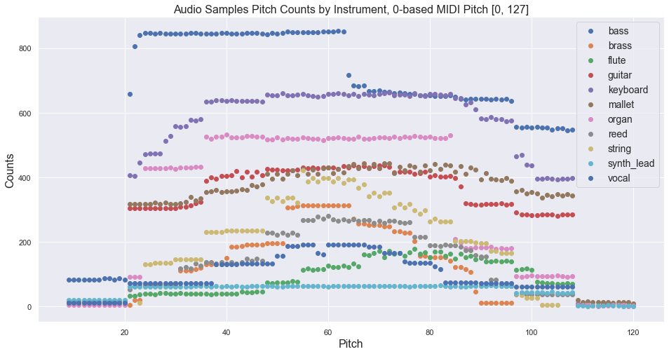
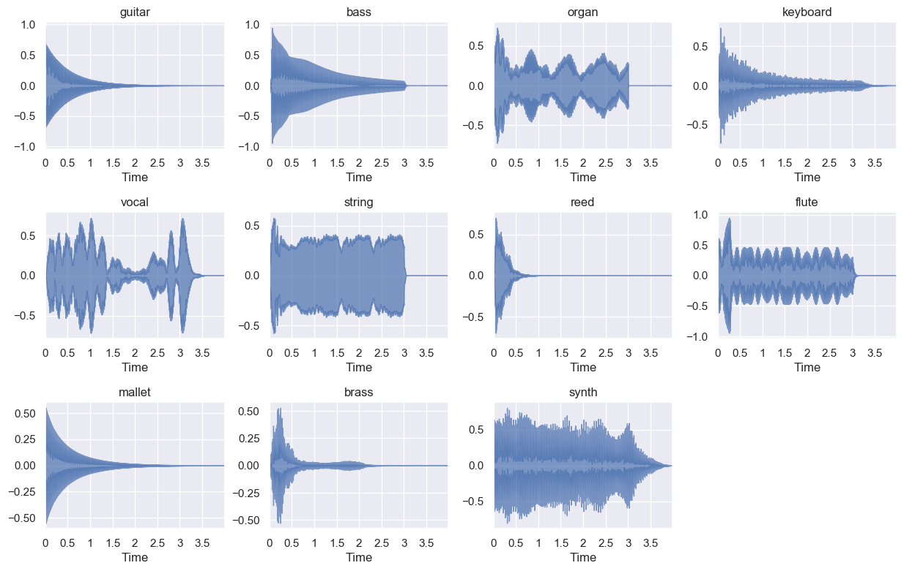
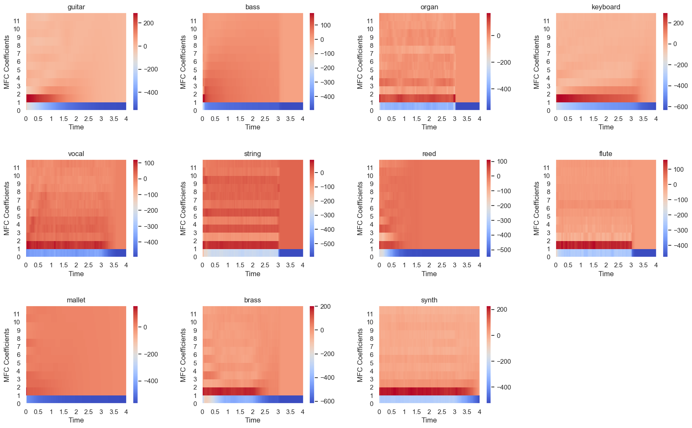
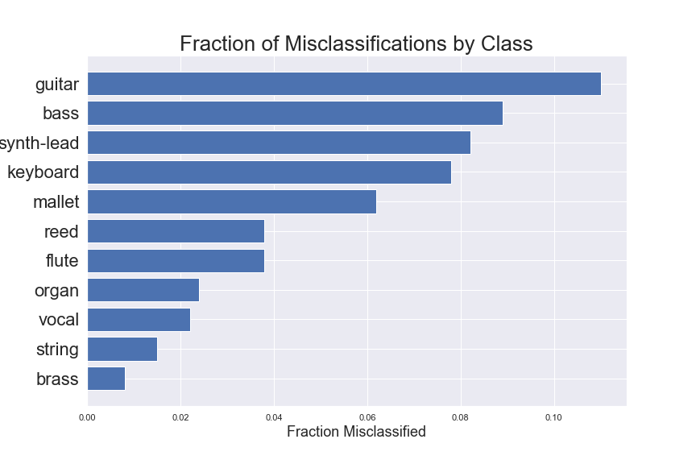

# Right In Tune

Ever hear a song you like and want to play along? If you play an instrument, you likely have had a thought like this before. What was that note again? How did they play that part? Let me listen again...

Music transcription is the practice of notating a piece of music, creating sheet music by writing down the notes, in music notation, that make up the piece. Music transcription can be challenging and time consuming, especially for an amateur musician. 

The goal of this project is to explore one aspect of music transcription, instrument classification, by building a machine learning model to classify audio samples by the instrument that created the sound.

## About the Data

This project will use the labeled magenta NSynth Dataset, https://magenta.tensorflow.org/datasets/nsynth#files, an audio dataset containing 305,979  four-second audio samples of musical notes, each with a unique pitch, timbre and envelop. The dataset includes audio samples from 1,006 unique instruments, ranging over every pitch of a standard MIDI piano (21-108) as well as five different velocities (25, 50, 75, 100, 127). Some instruments were not capable of producing all 88 pitches in this range, resulting in an average of 65.4 pitches per unique instrument. 

See the plots below for the counts by instrument type and source and the distribution of pitch by instrument. 

## Audio Processing
All the audio files I used were labeled with instrument type as well as pitch and velocity and were in .wav format. I used librosa, Python's module for audio and music processing to extract features from the audio files.
I started by looking at some examples of the soundwaves produced by each of the different instrument classes.  You can see the amplitude of the wave over time, each audio clip 4 seconds long.

Python's librosa module makes it very easy to extract and visualize various features from audio time series data. Some early research indicated that the spectrogram of the audio data could be saved as an image and used to train a model related to music classification tasks. A spectrogram is a visual representation of the spectrum of frequencies of an audio signal over time. I specfically looked into the mel-frequency spectrogram, which is a spectrogram with frequencies in the mel scale, which is just a non-linear transformation of the frequency scale that is based on human perception of pitches. In audio classification tasks, it has been proven particularly useful to transform frequencies into the mel-scale, since this most closely is related to the way that we as humans perceive sound. See examples of mel-spectrograms from each instrument class below.

The last audio feature I looked at was Mel-frequency cepstral coefficients (MFCCs). A cepstral representation of an audio sample is a nonlinear "spectrum-of-a-spectrum" (hence the backwards name!), and is just one more unique way to represent the spectrum of a sound. A mel-frequency cepstrum (MFC) is a representation of that spectrum that is based on a linear cosine transform of a log power spectrum on a nonlinear mel-scale of frequency. Remember that the frequency bands on mel-scale approximate human audio processing more closely than other spaced freqency bands (such as linear), and that is why it is useful! And lastly, MFCCs are just the coefficients that collectively make up that MFC.  

The plots below show examples of frequency intensity displays over time of the cepstral coefficients on a modified (mel) frequency scale. 

## Models

### CNN models using MFCC plots as images
- My initial modeling technique was to use the plotted MFCCS (shown above) as images to train a CNN classifier. 
- My steps are described below, starting with the collection of these images.
### Image Processing: 
- Created MFCC plots for all audio samples, saving each as an image
- Restructured image files into class folders, each with 2,000 images, in order to balance classes
- Used tensorflow "flow from directory" to get labeled MFCC image data, labeled by class, as a generator object
- Batch size: 32
- Image size: (180, 180)
- 3 'rbg' channels (ignored the images' fourth channel: opacity)
- Normalized data to a scale 0-1 for CNN model
- Used 'preprocess_input' as preprocessing function (includes normalization) for Transfer Model
- Did not use image augmentation, as the MFCC images represent subtle differences in audio qualities and shifting/rotating/reflecting would interfer with that information, as confirmed by testing models both with and without augmentation
- In the end, had a training image generator made up of 22,000 images, with 20% set aside as a validation subset. 
- A test set was generated from a separate hold out data set, with a total of ~1,700 images. 

### CNN Model
- The biggest challenge building the CNN was trying to reduce overfitting. Throughout modeling iterations, I experimented with dropout layers, batch normalization layers, and both shallow and deep networks.  
- The shallower networks tended to underfit the data, performing poorly on training and validation data, and the deeper networks tended to overfit the data, performing well on training data and poorly on validation data.
- Most architectures that I worked with had a training accuracy above 90% and a validation accuracy of 60-70%. I was unable to get the validation above 68% with any of the models. The architecture below gave me my best results, with higher validation accuracies overall and more epochs before the model began to overfit. 
- Total params: 2,680,139
- Trainable params: 2,680,139
- Non-trainable params: 0

 

#### Results:
- Train Loss: 0.82, Train Accuracy: 0.71
- Validation Loss: 1.07, Validation Accuracy: 0.64
- Test Loss: 2.21, Test Accuracy: 0.51

 

### Transfer Learning CNN Model
- Implemented an Xception model architecture, trained on 'ImageNet' data
- A 132-layer model, made up of 14 blocks, each with convolutional layers, batch normalization layers, and pooling layers
- Fine tuned the model, starting with replacing the top layer, then going a block layer deep at a time, a total of 5 layers deep
- As shown in the accuracy-loss plots, this model was overfitting my data with each layer of fine-tuning. It seems I need more data in order to use such a deep network with a large number of parameters. 
- Total params: 20,884,019
- Trainable params: 11,652,851
- Non-trainable params: 9,231,168

#### Results:
- Train Loss: 0.23 , Train Accuracy: 0.92
- Validation Loss: 1.64, Validation Accuracy:0.65 
- Test Loss: 2.45 , Test Accuracy: 0.62

 

## Models built from mfcc coefficients as features
- My next modeling technique was to extract the MFCCs for each audio file in an array and use these coefficients as features to train a model.
### Feature collection
- Extracted 40 MFCC coefficients from each 173-frame audio file using librosa
- For each audio file, took the mean value of each MFCC coeficient
- Transformed the coefficients into a numpy array with shape, (300000, 40), and got the corresponding instrument labels in an array (300000,).
- Train-test-split: 20% set aside test set
- Balanced training data using SMOTE sampling method
- After SMOTE, training feature matrix shape: (576829, 40)

### Random Forest Classifier
- Hyper Parameters: 100 trees, max features= square root of # of features, no max depth, gini impurty as split criterion

#### Results:
- Accuracy: 0.94
- Weighted Average Precision: 0.94
- Weighted Average Recall: 0.94

- It is often assumed that the first 12 MFCC coefficients capture most of the sound qualities that humans can hear.  This model used the first 40 MFCC coefficients.  The plots below show that while the first 12 MFCC coefficients were the most influential to the model's predictions, the remaining coefficients, 12-39, also had some influence on predictions, each affecting at least 1.5% of the samples, which is significant, when compared to several of the first 12 coefficients, which affected between 2 and 3% of the samples.  

 

## Conclusions
- A Random Forest Classifer, trained with MFCC coefficients as audio features, can effectively be used classify audio data by instrument, with 94% accuracy. 
- I believe a lot of my results are due to the quality of the MFCC feature data that I was able to use to train the Random Forest model, since I was able to use all the audio training samples (~300,000) with SMOTE sampling to balance classes. With the CNN models based on the MFCC images, on the other hand, I balanced classes by only sampling 2,000 images per class, so there wasn't nearly enough training data to make strong generalizations.

## Next Steps
#### Improve model accuracy
- Train a CNN with all audio data as images - use keras weighting feature to account for unbalanced classes
- Try to increase accuracy in Random Forest Model with hyperparameter tuning through a gridsearch
- Train other classifier models based on MFCC coefficients and an over- or under- sampling technique

#### Extend scope of the project
- Build a model to predict other features from the audio samples, like pitch or source
- Build a model to extract instrument and pitch from more complex audio samples, including multiple instruments playing together 

